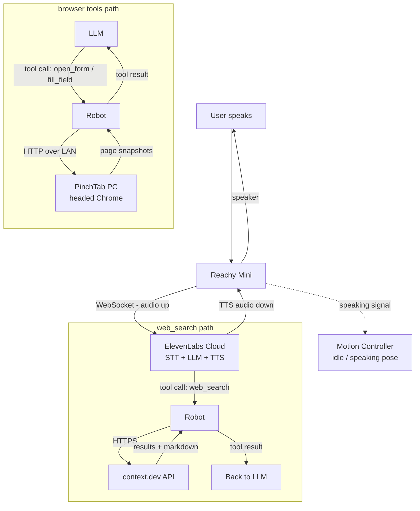

# reachy-11labs-agent — Voice-first web assistant for Reachy Mini

Talk to the robot and it searches the web, then fills forms on a real browser on screen.

## Architecture



All tool calls come from ElevenLabs over the WebSocket and execute on the robot. The robot then fans out to two different backends:

- **context.dev** (web_search) - robot calls the context.dev API directly over HTTPS, gets results back, and sends them to the LLM over the WebSocket.
- **PinchTab** (browser tools) - robot calls the PinchTab PC over HTTP on the LAN, PinchTab drives the visible Chrome window, and snapshots come back to the LLM the same way.

## How it works

The ElevenLabs agent runs in the cloud as the brain: STT, LLM, TTS, and tool calling. The robot runs a thin Python client with three responsibilities:

1. **ElevenLabs cloud agent** — transcribes speech, runs the LLM, synthesizes replies, and decides when to call a client tool.
2. **Robot client** — runs on Reachy Mini. Wires the robot mic/speaker to ElevenLabs via a custom `AudioInterface`, executes client tools locally, and drives speech-driven motion.
3. **PinchTab PC** — a separate machine on the same LAN that runs PinchTab's headed Chrome. The robot sends it commands over HTTP so the user sees the browser navigate and fill forms in real time.

Client tools run directly on the robot, not as webhooks. `web_search` hits the context.dev API from the robot and returns results to the LLM. Browser tools hit PinchTab over the LAN.

## Setup

### Prerequisites

- Reachy Mini with its daemon running
- A separate PC on the same LAN for PinchTab, with headed Chrome available
- An ElevenLabs account
- Python 3.11+
- A context.dev API key

### Install and start PinchTab

```bash
curl -fsSL https://pinchtab.com/install.sh | bash
pinchtab config set instanceDefaults.mode headed
./start_pinchtab.sh
```

`start_pinchtab.sh` binds PinchTab to the LAN, sets an auth token, and starts a headed instance. It prints the `PINCHTAB_URL` and token to put in the robot's `.env`.

Verify reachability from the robot:

```bash
curl http://pinchtab-pc:9867/health
```

### Install the robot client

```bash
cp .env.example .env
# Fill in: ELEVENLABS_API_KEY, AGENT_ID, REACHY_HOST, PINCHTAB_URL, CONTEXT_API_KEY

uv sync
```

### Configure the ElevenLabs agent

```bash
./setup_agent.sh
```

This is idempotent: it creates the agent if missing, registers the seven client tools from `tool_configs/`, and pushes the config to ElevenLabs. Requires `npm install -g @elevenlabs/cli` and `elevenlabs auth login` first.

### Run

```bash
uv run reachy-agent
```

Talk to the robot. Ask it to look something up on the web or fill a form. It narrates what it is doing while PinchTab fills the browser on screen.

### Deploy to the robot

```bash
./deploy.sh
```

Syncs the project to the robot over SSH and refreshes the venv. Set `ROBOT=user@host` to override the default target.

## Client tools

The agent has seven client tools, all executed on the robot:

- `web_search` — search the web via context.dev, returns results with page content
- `open_form` — navigate to a URL in headed Chrome, returns a page snapshot
- `fill_field` — fill an input by ref, returns an updated snapshot
- `click_element` — click by ref, returns an updated snapshot
- `press_key` — press a keyboard key, returns an updated snapshot
- `get_page_snapshot` — get current page interactive elements
- `get_page_text` — extract page text content

## Project structure

```
.
├── main.py              # entry point: wires audio + tools + conversation
├── reachy_audio.py      # AudioInterface for Reachy Mini mic/speaker
├── motion.py            # speech-driven idle/speaking motion
├── pinchtab_tools.py    # PinchTab client tools (browser control)
├── context_tools.py     # context.dev web_search client tool
├── tool_configs/        # ElevenLabs tool definition JSONs
├── setup_agent.sh        # creates/configures agent + tools (idempotent)
├── start_pinchtab.sh    # configures + starts PinchTab for LAN access
├── deploy.sh            # syncs project to the robot over SSH
├── pyproject.toml
└── .env.example
```

## Notes

- PinchTab refs expire after navigation; every tool snapshots again after acting.
- Client tool names are case-sensitive. They must match exactly between the ElevenLabs config and `client_tools.register()` in the code.
- `web_search` returns the first 2000 characters of page markdown per result, trimmed to keep context limits sane.
- The audio bridge applies DSP (AGC + noise suppression) to keep the mic clean for STT.
- `setup_agent.sh` is idempotent: safe to run multiple times, it reuses the existing agent and tools.
